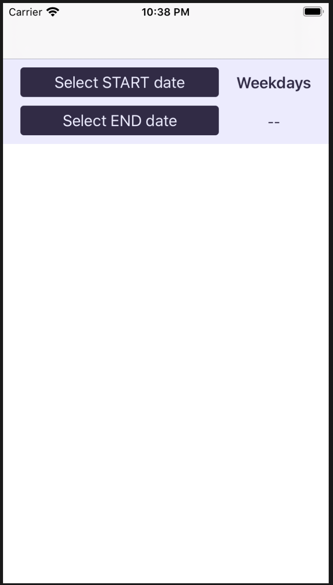
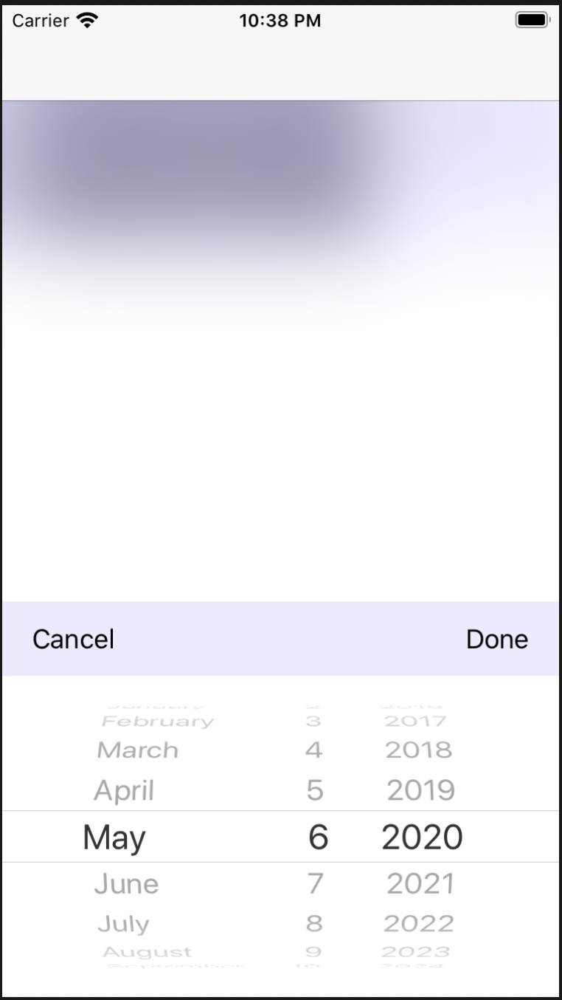
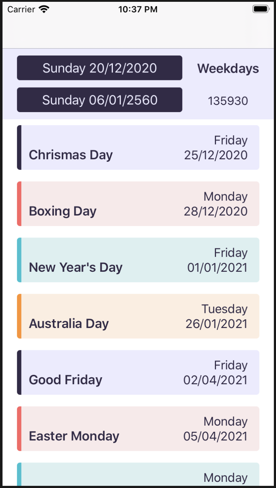

## App Introduction
The project is to calculate the number of working days between 2 dates, excluding weekends and holidays.
There are some types of holidays:
* The holiday is the same day every year. If it falls on weekend, the holiday will not extend to the next weekday. (for example: ANZAC day)
* The holiday is the same day every year. If it falls on weekend, the holiday will extend to nearest weekday. (for example: New Year day)
* The holiday occurs on a certain day in a specific month. (for example: Queen’s Birthday is on the second Monday of June every year)

The algorithm used in the app:
- The holidays are define in a JSON file, named `nsw.json` . At the moment, file is stored in the Bundle. To be extensible to use the app in other states, we can put this file on backend to retrieve based on user location. For example `vic.json`, `tas.json`.
- In this file, for each holiday will have:
```
    {
        “name”: “New Year’s Day”,
        “type”: “exactDay”,
        “day”: “1/1”,
        “moveToNearWeekDayIfWeekend”: true
    }
```
When `type` is `exactDay`, that means the holiday will occur on the same day every year. The property `moveToNearWeekDayIfWeekend` is to define the logic to find the nearest weekday if the holiday falls on weekend. This is to apply for the 2nd holiday type mentioned above.

When `type` is `dayOfMonth`, we have this JSON format:
```
{
        "name": "Queen's Birthday",
        "type": "dayOfMonth",
        "order": 2,
        "dayOfWeek": 2,
        "month": 6,
}
```
The above example means `Queen's Birthday` is always on the second Monday of June, for every year.
Apart from holidays mentioned above, in Australia, we also have Easter holidays, usually from Good Friday to Easter Monday.

## App architecture

The app applies MVVM architecture. To calculate working days, it is possible for users to input 2 dates which are very far from each other, therefore I run the algorithm in other thread rather than main thread, by using Operation and OperationQueue.

## How to use

When the app run, we will see this screenshot:



Users have to select START date and END date for calculation. The screen to let users choose the date:



And the result:



On the top show the number of working days exclude weekend and holidays. The table will show the list of holidays between START date and END date.

## Algorithm

- If start date or end date falls on weekend, find the next weekday for start date and previous weekday for end date.
- Find the week difference between the start date and end date
- Find the day difference between the start date and end date
- Find the holiday between start. date and end date, based on the JSON file specific for the state or country
- Based on above values, we can have the formula to get the working days between start date and end date
```
result = endDay - startDay - (endWeek - startWeek) * 2 - holidayBetweenStartAndEnd
```
- We also need to exclude startDay and endDay in calculation
